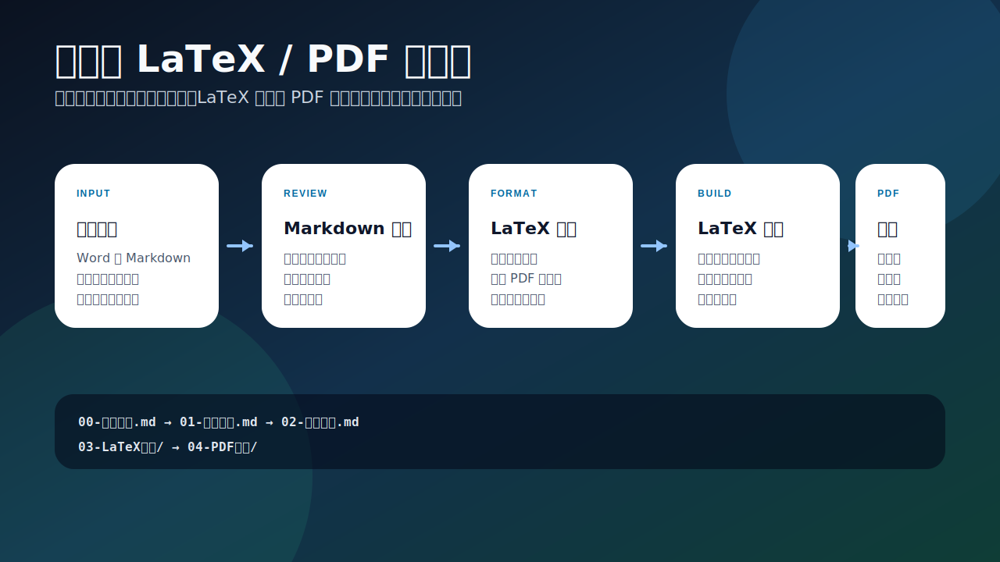
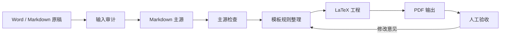
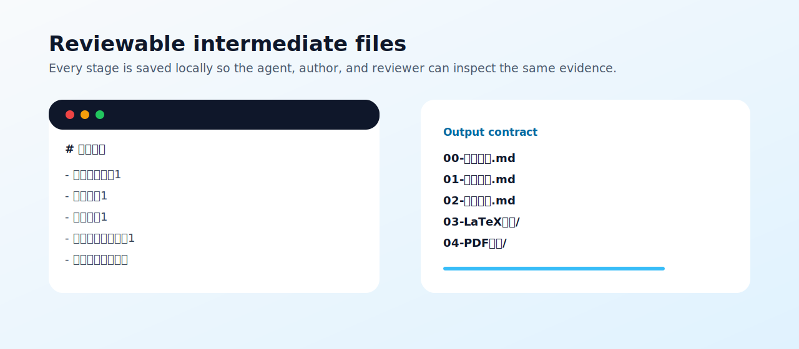

<div align="center">

# Manuscript to LaTeX PDF Skill

**把 Word / Markdown 论文转换为可审阅 Markdown 主源、LaTeX 工程和符合模板要求的 PDF。**

[](https://github.com/TeoZ123/manuscript-to-latex-pdf-skill/actions/workflows/ci.yml)
[](https://github.com/TeoZ123/manuscript-to-latex-pdf-skill/releases)
[](LICENSE)
[](manuscript-to-latex-pdf/SKILL.md)

</div>



## 项目简介

这是一个面向论文、报告和正式文档排版的 AI Agent Skill。它的目标不是“随便生成一个 PDF”，而是让 AI 助手根据你提供的 LaTeX 模板和范例，逐步完成：

- 从 Word 或 Markdown 原稿中整理出可审阅的 Markdown 主源。
- 从 LaTeX 模板中提取格式规则。
- 生成可复查的 LaTeX 工程。
- 编译输出符合模板要求的 PDF。
- 保存每一步中间结果，方便定位问题和反复修改。

适合学位论文、课程论文、期刊论文、研究报告、项目文档等需要严格格式控制的场景。

## 为什么需要这个 Skill

很多论文转换流程有两个问题：

- 直接跳到 PDF，错误只在最后暴露，排查成本高。
- 直接把 LaTeX 当主源，作者很难继续审阅正文、图表、参考文献和附录。

这个 Skill 把流程拆开：Word 是输入来源，Markdown 是正文主源，LaTeX 模板负责格式，PDF 是最终结果。每一步都有本地文件，便于验收、回滚和继续修改。

## 快速开始

把 `manuscript-to-latex-pdf/` 目录交给支持本地文件或自定义指令的 AI 助手，然后使用下面的自然语言指令：

```text
请使用 manuscript-to-latex-pdf skill，把我的 Word 或 Markdown 论文转换为干净的 Markdown 主源，根据我提供的 LaTeX 模板学习格式规则，生成 LaTeX 工程，编译 PDF，并把每一步中间结果保存到本地。
```

如果使用 Codex，可以把 skill 目录复制到本地 skills 目录：

```bash
cp -R manuscript-to-latex-pdf ~/.codex/skills/
```

也可以不通过 AI 助手，直接运行内置脚本完成基础检查：

```bash
# 1. 审计 Word 原稿结构
python3 manuscript-to-latex-pdf/scripts/audit_docx.py manuscript.docx \
  -o 00-输入审计.md \
  --json-output 00-输入审计.json

# 2. 将 Word 转为 Markdown 主源
python3 manuscript-to-latex-pdf/scripts/extract_docx_to_md.py manuscript.docx \
  -o 01-论文主源.md \
  --assets-dir 附件

# 3. 检查 Markdown 主源
python3 manuscript-to-latex-pdf/scripts/validate_manuscript.py 01-论文主源.md \
  -o 02-转换检查.md
```

## 工作流程





## 输出结果

| 阶段 | 输出文件 | 作用 |
| --- | --- | --- |
| 输入审计 | `00-输入审计.md` | 检查 Word 结构、样式、图片、表格、批注、修订、脚注尾注和参考文献线索。 |
| 正文主源 | `01-论文主源.md` | 保留正文、图表、题注、资料来源、引用、参考文献、附录、致谢等内容。 |
| 转换检查 | `02-转换检查.md` | 检查图片链接、图题、表题、引用编号、参考文献、占位符和人工复核项。 |
| 模板规则 | `00-模板规则.md` | 记录从 LaTeX 模板和范例中整理出的格式规则。 |
| LaTeX 与 PDF | `03-LaTeX工程/`, `04-PDF输出/` | 生成 LaTeX 工程并编译最终 PDF。 |

默认输出结构：

```text
00-模板规则.md
01-论文主源.md
02-转换检查.md
03-LaTeX工程/
04-PDF输出/
```

如果论文较长，可以拆分为章节文件：

```text
01-Markdown主源/
├── 00-论文总览.md
├── 01-摘要.md
├── 02-第一章.md
├── ...
├── 90-参考文献.md
└── 91-附录.md
```

拆分只是为了便于上下文管理和局部修改。图片、表格和题注仍应保留在对应章节语境中。

## 准备 LaTeX 模板

生成 LaTeX 前，建议提供以下材料：

- `.cls` / `.sty`
- `main.tex`
- 章节 `.tex` 范例
- 模板 PDF 范例
- 参考文献写法示例
- 编译说明
- 官方格式要求

原则很简单：LaTeX 模板决定格式，Markdown 主源承载正文，PDF 只作为最终验收结果。

## Skill 目录结构

```text
manuscript-to-latex-pdf/
├── SKILL.md
├── agents/
│   └── openai.yaml
├── references/
│   ├── template-rules.md
│   ├── validation-loop.md
│   └── word-to-markdown.md
└── scripts/
    ├── audit_docx.py
    ├── extract_docx_to_md.py
    └── validate_manuscript.py
```

只有 `manuscript-to-latex-pdf/` 是可复用的 Skill 本体。仓库根目录的 README、示例、测试和 GitHub Actions 是公开发布与开发材料。

## 示例

`examples/` 目录包含一个极简自制样例：

```text
examples/
├── 00-模板规则.md
├── 01-论文主源.md
├── 02-转换检查.expected.md
└── 附件/
    └── 图1-1-论文转换流程示意图.svg
```

运行 smoke test：

```bash
python3 tests/smoke_test.py
```

## 能力边界

- 不会在用户未要求时改写学术内容。
- 不会编造参考文献、资料来源、图号、表号、页码或“已通过”的验证结论。
- 默认不内置任何学校、期刊或机构的专属模板规则。
- 不保证复杂 Word 特性完全自动还原，例如合并表格、修订痕迹、脚注、批注、自动编号、文本框和嵌入对象；这些内容会进入人工复核。

## 处理私有文档

不要把私人论文、盲审意见、付费模板、个人信息、未公开论文内容提交到公开仓库。

如果需要放模板示例，应使用自己编写的极简模板，或使用明确允许再分发的模板。

## 开发检查

```bash
python3 -m py_compile manuscript-to-latex-pdf/scripts/*.py tests/*.py
python3 tests/smoke_test.py
```

GitHub Actions 会在 push 和 pull request 时运行同样的检查。

## 贡献

欢迎提交 Issue 或 Pull Request，尤其是：

- 不同学校或期刊模板的转换经验。
- Word 表格、脚注、批注、修订痕迹的处理改进。
- Markdown 到 LaTeX 的映射规则改进。
- 更好的示例和测试用例。

## 开源协议

MIT License.
