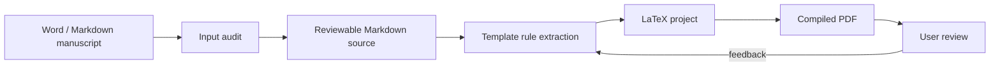

# Manuscript to LaTeX PDF Skill

[中文](README.zh-CN.md) | English

[](https://github.com/TeoZ123/manuscript-to-latex-pdf-skill/actions/workflows/ci.yml)
[](https://github.com/TeoZ123/manuscript-to-latex-pdf-skill/releases)
[](LICENSE)
[](manuscript-to-latex-pdf/SKILL.md)

A Codex skill for converting Word or Markdown manuscripts into reviewable Markdown sources, template-compliant LaTeX projects, and compiled PDFs.

It is built for theses, papers, reports, and formal manuscripts where the final PDF must follow a user-provided LaTeX template rather than a generic layout.


## Visual Workflow



## What It Does

| Stage | Output | Purpose |
| --- | --- | --- |
| Audit | `00-输入审计.md` | Detect DOCX structure, styles, images, tables, comments, revisions, notes, and references. |
| Source | `01-论文主源.md` | Keep a human-editable manuscript source with figures, tables, captions, references, and back matter. |
| Check | `02-转换检查.md` | Validate image links, figure/table captions, citations, references, placeholders, and manual review risks. |
| Template rules | `00-模板规则.md` | Summarize the formatting rules extracted from the user-provided LaTeX template. |
| LaTeX/PDF | `03-LaTeX工程/`, `04-PDF输出/` | Generate a template-compliant LaTeX project and compile the final PDF. |

## What It Does Not Do

- It does not rewrite academic content unless the user explicitly asks.
- It does not fabricate references, source notes, figure numbers, table numbers, page numbers, or successful validation status.
- It does not include school-specific or journal-specific template rules by default.
- It does not guarantee perfect Word fidelity for complex DOCX features such as merged tables, tracked changes, footnotes, comments, automatic numbering, floating text boxes, or embedded objects. These are flagged for manual review.

## Install

Copy the skill folder into your Codex skills directory:

```bash
cp -R manuscript-to-latex-pdf ~/.codex/skills/
```

Then ask Codex to use `$manuscript-to-latex-pdf`.

Only the `manuscript-to-latex-pdf/` directory is the skill. Repository-level files such as this README, examples, tests, and GitHub Actions are for public distribution and development.

## Quick Start

```bash
# 1. Audit a DOCX manuscript
python3 manuscript-to-latex-pdf/scripts/audit_docx.py manuscript.docx \
  -o 00-输入审计.md \
  --json-output 00-输入审计.json

# 2. Extract DOCX to Markdown
python3 manuscript-to-latex-pdf/scripts/extract_docx_to_md.py manuscript.docx \
  -o 01-论文主源.md \
  --assets-dir 附件

# 3. Validate the Markdown source
python3 manuscript-to-latex-pdf/scripts/validate_manuscript.py 01-论文主源.md \
  -o 02-转换检查.md
```

## Default Output Layout

```text
00-模板规则.md
01-论文主源.md
02-转换检查.md
03-LaTeX工程/
04-PDF输出/
```

For large manuscripts, the skill may split the Markdown source into chapter files:

```text
01-Markdown主源/
├── 00-论文总览.md
├── 01-摘要.md
├── 02-第一章.md
├── ...
├── 90-参考文献.md
└── 91-附录.md
```

Splitting is for context management only. Figures and tables should remain in the relevant chapter context.

## Template Inputs

Ask the user for the template evidence before generating LaTeX:

- `.cls` / `.sty`
- `main.tex`
- sample chapter `.tex`
- sample PDF
- bibliography examples
- compile notes
- any official formatting instructions

The LaTeX template is the formatting authority. Markdown is the human-editable content authority after extraction.

## Examples

The `examples/` directory contains:

- `examples/01-论文主源.md`
- `examples/00-模板规则.md`
- `examples/02-转换检查.expected.md`
- `examples/附件/图1-1-论文转换流程示意图.svg`

Run the smoke test:

```bash
python3 tests/smoke_test.py
```

## Public Template Guidance

Do not commit private manuscripts, confidential review comments, paid school templates, personal data, or unreleased thesis content to this public repository.

For template examples, use a tiny self-authored template fixture or a template that is clearly licensed for redistribution.

## Development

```bash
python3 -m py_compile manuscript-to-latex-pdf/scripts/*.py tests/*.py
python3 tests/smoke_test.py
```

GitHub Actions runs the same checks on push and pull request.

## License

MIT License.
