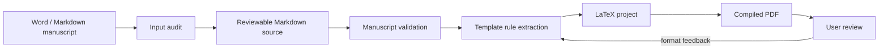

<div align="center">

# Manuscript to LaTeX PDF Skill

**Turn Word or Markdown manuscripts into reviewable Markdown sources, template-compliant LaTeX projects, and compiled PDFs.**

[中文](README.zh-CN.md) | English

[](https://github.com/TeoZ123/manuscript-to-latex-pdf-skill/actions/workflows/ci.yml)
[](https://github.com/TeoZ123/manuscript-to-latex-pdf-skill/releases)
[](LICENSE)
[](manuscript-to-latex-pdf/SKILL.md)

</div>


This repository contains an AI-agent skill for formal manuscript conversion. It is built for theses, papers, reports, and other documents where the final PDF must follow a user-provided LaTeX template rather than a generic layout.

The skill keeps conversion work inspectable: Word is treated as input, Markdown becomes the human-editable source, the LaTeX template is the formatting authority, and every intermediate report is saved locally.

## Why This Exists

Most manuscript conversion workflows fail in two ways: they hide conversion errors until the final PDF, or they turn LaTeX into the only editable source. This skill uses a staged workflow so authors can review the manuscript source, template rules, validation report, LaTeX project, and PDF separately.

## Workflow




## What It Produces

| Stage | Output | Purpose |
| --- | --- | --- |
| Input audit | `00-输入审计.md` | Detect DOCX structure, styles, images, tables, comments, revisions, notes, and reference-section clues. |
| Markdown source | `01-论文主源.md` | Keep figures, tables, captions, source notes, citations, references, appendices, acknowledgements, and back matter in one reviewable source. |
| Conversion check | `02-转换检查.md` | Validate image links, figure/table captions, citations, references, placeholders, HTML tables, and manual review risks. |
| Template rules | `00-模板规则.md` | Summarize formatting rules extracted from `.cls`, `.sty`, `main.tex`, sample `.tex`, sample PDF, and bibliography examples. |
| LaTeX/PDF | `03-LaTeX工程/`, `04-PDF输出/` | Generate a template-compliant LaTeX project and compile the final PDF. |

## Use with an AI Agent

Use the `manuscript-to-latex-pdf/` folder as the agent instruction package. For Codex, copy it into your local skills directory:

```bash
cp -R manuscript-to-latex-pdf ~/.codex/skills/
```

For other AI coding agents, attach or reference the same folder and ask the agent to follow `manuscript-to-latex-pdf/SKILL.md`.

Natural-language prompt:

```text
Use the manuscript-to-latex-pdf skill. Convert my Word or Markdown manuscript into a clean Markdown source, learn the formatting rules from my LaTeX template, generate a LaTeX project, compile the PDF, and save each intermediate result locally.
```

Only `manuscript-to-latex-pdf/` is the reusable agent skill. Repository-level files such as this README, examples, tests, and GitHub Actions are for public distribution and development.

## Quick Start

Audit a Word manuscript:

```bash
python3 manuscript-to-latex-pdf/scripts/audit_docx.py manuscript.docx \
  -o 00-输入审计.md \
  --json-output 00-输入审计.json
```

Extract Word to Markdown:

```bash
python3 manuscript-to-latex-pdf/scripts/extract_docx_to_md.py manuscript.docx \
  -o 01-论文主源.md \
  --assets-dir 附件
```

Validate the Markdown source:

```bash
python3 manuscript-to-latex-pdf/scripts/validate_manuscript.py 01-论文主源.md \
  -o 02-转换检查.md
```

## Default Output Layout

```text
00-模板规则.md
01-论文主源.md
02-转换检查.md
03-LaTeX工程/
04-PDF输出/
```

For large manuscripts, the skill may split the Markdown source into chapter files:

```text
01-Markdown主源/
├── 00-论文总览.md
├── 01-摘要.md
├── 02-第一章.md
├── ...
├── 90-参考文献.md
└── 91-附录.md
```

Splitting is for context management only. Figures and tables should remain in the relevant chapter context.

## Provide a LaTeX Template

Before generating LaTeX, give the agent the template files and examples that define the target format:

- `.cls` / `.sty`
- `main.tex`
- sample chapter `.tex`
- sample PDF
- bibliography examples
- compile notes
- official formatting instructions

The LaTeX template is the formatting authority. Markdown is the human-editable content authority after extraction.

## What It Does Not Do

- It does not rewrite academic content unless explicitly requested.
- It does not fabricate references, source notes, figure numbers, table numbers, page numbers, or successful validation status.
- It does not include school-specific or journal-specific template rules by default.
- It does not guarantee perfect Word fidelity for complex DOCX features such as merged tables, tracked changes, footnotes, comments, automatic numbering, floating text boxes, or embedded objects. These are flagged for manual review.

## Examples

The `examples/` directory contains a tiny self-authored fixture:

```text
examples/
├── 00-模板规则.md
├── 01-论文主源.md
├── 02-转换检查.expected.md
└── 附件/
    └── 图1-1-论文转换流程示意图.svg
```

Run the smoke test:

```bash
python3 tests/smoke_test.py
```

## Use with Private Documents

Do not commit private manuscripts, confidential review comments, paid school templates, personal data, or unreleased thesis content to a public repository.

For public examples, use tiny self-authored fixtures or templates that are clearly licensed for redistribution.

## Development

```bash
python3 -m py_compile manuscript-to-latex-pdf/scripts/*.py tests/*.py
python3 tests/smoke_test.py
```

GitHub Actions runs the same checks on push and pull request.

## License

MIT License.
