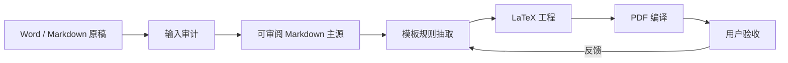

# Manuscript to LaTeX PDF Skill

中文 | [English](README.md)

[](https://github.com/TeoZ123/manuscript-to-latex-pdf-skill/actions/workflows/ci.yml)
[](https://github.com/TeoZ123/manuscript-to-latex-pdf-skill/releases)
[](LICENSE)
[](manuscript-to-latex-pdf/SKILL.md)

这是一个 Codex skill，用于把 Word 或 Markdown 论文稿件转换为可审阅的 Markdown 主源、符合 LaTeX 模板规则的工程文件，以及最终 PDF。

适用场景包括学位论文、课程论文、期刊论文、研究报告等。核心目标不是生成通用 PDF，而是根据用户提供的 LaTeX 模板和范例沉淀格式规则，并输出符合模板要求的结果。


## 流程图



## 它能做什么

| 阶段 | 输出 | 作用 |
| --- | --- | --- |
| 输入审计 | `00-输入审计.md` | 检查 DOCX 结构、样式、图片、表格、批注、修订、脚注尾注和参考文献线索。 |
| 主源生成 | `01-论文主源.md` | 保留正文、图表、题注、资料来源、参考文献、附录和后置内容。 |
| 转换检查 | `02-转换检查.md` | 检查图片链接、图题、表题、引用编号、参考文献、占位符和人工复核项。 |
| 模板规则 | `00-模板规则.md` | 根据用户提供的 LaTeX 模板总结格式规则。 |
| LaTeX/PDF | `03-LaTeX工程/`, `04-PDF输出/` | 生成符合模板规则的 LaTeX 工程并编译 PDF。 |

## 它不做什么

- 不在用户未要求时改写学术内容。
- 不编造参考文献、资料来源、图号、表号、页码或“已通过”的验证结论。
- 默认不内置任何学校、期刊或机构的专属模板规则。
- 不保证复杂 Word 特性完全还原，例如合并表格、修订痕迹、脚注、批注、自动编号、文本框和嵌入对象；这些内容会进入人工复核。

## 安装

把 skill 目录复制到 Codex skills 目录：

```bash
cp -R manuscript-to-latex-pdf ~/.codex/skills/
```

然后在 Codex 中请求使用 `$manuscript-to-latex-pdf`。

注意：只有 `manuscript-to-latex-pdf/` 目录是 skill 本体。仓库根目录的 README、示例、测试和 GitHub Actions 是公开发布与开发材料。

## 快速开始

```bash
# 1. 审计 DOCX 原稿
python3 manuscript-to-latex-pdf/scripts/audit_docx.py manuscript.docx \
  -o 00-输入审计.md \
  --json-output 00-输入审计.json

# 2. 将 DOCX 转为 Markdown 主源
python3 manuscript-to-latex-pdf/scripts/extract_docx_to_md.py manuscript.docx \
  -o 01-论文主源.md \
  --assets-dir 附件

# 3. 检查 Markdown 主源
python3 manuscript-to-latex-pdf/scripts/validate_manuscript.py 01-论文主源.md \
  -o 02-转换检查.md
```

## 默认输出结构

```text
00-模板规则.md
01-论文主源.md
02-转换检查.md
03-LaTeX工程/
04-PDF输出/
```

如果论文过长，skill 可以切换为章节拆分模式：

```text
01-Markdown主源/
├── 00-论文总览.md
├── 01-摘要.md
├── 02-第一章.md
├── ...
├── 90-参考文献.md
└── 91-附录.md
```

拆分只是为了控制上下文和便于局部修改。图片和表格仍应保留在对应章节语境中。

## 模板输入

生成 LaTeX 前，应引导用户提供模板证据：

- `.cls` / `.sty`
- `main.tex`
- 章节 `.tex` 范例
- 模板 PDF 范例
- 参考文献写法示例
- 编译说明
- 官方格式要求

LaTeX 模板是格式权威；Word 是内容来源；转换后的 Markdown 是后续人工审阅和修改的主源。

## 示例

`examples/` 目录包含：

- `examples/01-论文主源.md`
- `examples/00-模板规则.md`
- `examples/02-转换检查.expected.md`
- `examples/附件/图1-1-论文转换流程示意图.svg`

运行 smoke test：

```bash
python3 tests/smoke_test.py
```

## 公开模板注意事项

不要把私人论文、盲审意见、付费模板、个人信息、未公开论文内容提交到这个公开仓库。

如果需要放模板示例，应使用自己编写的极简模板，或明确允许再分发的模板。

## 开发检查

```bash
python3 -m py_compile manuscript-to-latex-pdf/scripts/*.py tests/*.py
python3 tests/smoke_test.py
```

GitHub Actions 会在 push 和 pull request 时运行同样的检查。

## License

MIT License.
