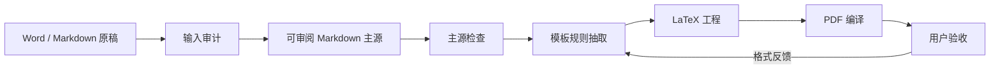

<div align="center">

# Manuscript to LaTeX PDF Skill

**将 Word 或 Markdown 论文稿件转换为可审阅 Markdown 主源、符合模板规则的 LaTeX 工程和最终 PDF。**

中文 | [English](README.md)

[](https://github.com/TeoZ123/manuscript-to-latex-pdf-skill/actions/workflows/ci.yml)
[](https://github.com/TeoZ123/manuscript-to-latex-pdf-skill/releases)
[](LICENSE)
[](manuscript-to-latex-pdf/SKILL.md)

</div>


这是一个面向正式论文与报告排版的 AI agent skill。它适合学位论文、课程论文、期刊论文、研究报告等场景，目标不是生成一个通用 PDF，而是根据用户提供的 LaTeX 模板、范例和格式说明，输出符合模板要求的 LaTeX 工程和 PDF。

它把转换过程拆成可检查的阶段：Word 是输入来源，Markdown 是后续人工审阅和修改的主源，LaTeX 模板是格式权威，每一层处理结果都会保存为本地文件。

## 为什么需要它

普通论文转换流程常见的问题是：错误被隐藏到最后的 PDF 才暴露，或者直接把 LaTeX 变成唯一可编辑源，导致用户难以审阅正文。这个 skill 采用分层工作流，分别保存主源、模板规则、检查报告、LaTeX 工程和 PDF，便于逐层验收与返工。

## 工作流程




## 输出什么

| 阶段 | 输出 | 作用 |
| --- | --- | --- |
| 输入审计 | `00-输入审计.md` | 检查 DOCX 结构、样式、图片、表格、批注、修订、脚注尾注和参考文献线索。 |
| Markdown 主源 | `01-论文主源.md` | 保留正文、图表、题注、资料来源、引用、参考文献、附录、致谢和后置内容。 |
| 转换检查 | `02-转换检查.md` | 检查图片链接、图题、表题、引用编号、参考文献、占位符、HTML 表格和人工复核项。 |
| 模板规则 | `00-模板规则.md` | 根据 `.cls`、`.sty`、`main.tex`、章节范例、模板 PDF 和参考文献范例抽取格式规则。 |
| LaTeX/PDF | `03-LaTeX工程/`, `04-PDF输出/` | 生成符合模板规则的 LaTeX 工程并编译 PDF。 |

## 用在 AI Agent 中

把 `manuscript-to-latex-pdf/` 目录作为 agent 的任务说明包使用。对于 Codex，可以复制到本地 skills 目录：

```bash
cp -R manuscript-to-latex-pdf ~/.codex/skills/
```

对于其他支持本地文件或自定义指令的 AI agent，可以直接附上或引用这个目录，并要求 agent 按照 `manuscript-to-latex-pdf/SKILL.md` 执行。

自然语言指令示例：

```text
请使用 manuscript-to-latex-pdf skill，把我的 Word 或 Markdown 论文转换为干净的 Markdown 主源，根据我提供的 LaTeX 模板学习格式规则，生成 LaTeX 工程，编译 PDF，并把每一步中间结果保存到本地。
```

注意：只有 `manuscript-to-latex-pdf/` 目录是可复用的 agent skill。仓库根目录的 README、示例、测试和 GitHub Actions 是公开发布与开发材料。

## 快速开始

审计 Word 原稿：

```bash
python3 manuscript-to-latex-pdf/scripts/audit_docx.py manuscript.docx \
  -o 00-输入审计.md \
  --json-output 00-输入审计.json
```

将 Word 转为 Markdown：

```bash
python3 manuscript-to-latex-pdf/scripts/extract_docx_to_md.py manuscript.docx \
  -o 01-论文主源.md \
  --assets-dir 附件
```

检查 Markdown 主源：

```bash
python3 manuscript-to-latex-pdf/scripts/validate_manuscript.py 01-论文主源.md \
  -o 02-转换检查.md
```

## 默认输出结构

```text
00-模板规则.md
01-论文主源.md
02-转换检查.md
03-LaTeX工程/
04-PDF输出/
```

如果论文过长，skill 可以切换为章节拆分模式：

```text
01-Markdown主源/
├── 00-论文总览.md
├── 01-摘要.md
├── 02-第一章.md
├── ...
├── 90-参考文献.md
└── 91-附录.md
```

拆分只是为了控制上下文和便于局部修改。图片和表格仍应保留在对应章节语境中。

## 准备 LaTeX 模板

生成 LaTeX 前，应尽量向 agent 提供能够定义目标格式的模板文件和范例：

- `.cls` / `.sty`
- `main.tex`
- 章节 `.tex` 范例
- 模板 PDF 范例
- 参考文献写法示例
- 编译说明
- 官方格式要求

LaTeX 模板是格式权威；Word 是内容来源；转换后的 Markdown 是后续人工审阅和修改的主源。

## 它不做什么

- 不在用户未要求时改写学术内容。
- 不编造参考文献、资料来源、图号、表号、页码或“已通过”的验证结论。
- 默认不内置任何学校、期刊或机构的专属模板规则。
- 不保证复杂 Word 特性完全还原，例如合并表格、修订痕迹、脚注、批注、自动编号、文本框和嵌入对象；这些内容会进入人工复核。

## 示例

`examples/` 目录包含一个极简自制样例：

```text
examples/
├── 00-模板规则.md
├── 01-论文主源.md
├── 02-转换检查.expected.md
└── 附件/
    └── 图1-1-论文转换流程示意图.svg
```

运行 smoke test：

```bash
python3 tests/smoke_test.py
```

## 处理私有文档

不要把私人论文、盲审意见、付费模板、个人信息、未公开论文内容提交到公开仓库。

如果需要放模板示例，应使用自己编写的极简模板，或明确允许再分发的模板。

## 开发检查

```bash
python3 -m py_compile manuscript-to-latex-pdf/scripts/*.py tests/*.py
python3 tests/smoke_test.py
```

GitHub Actions 会在 push 和 pull request 时运行同样的检查。

## License

MIT License.
