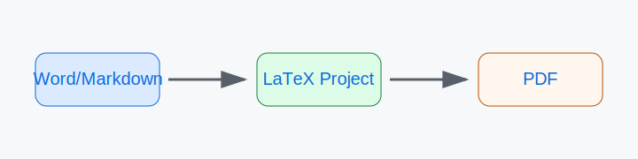

# 摘要

本文展示一个最小论文转换样例，用于验证 Markdown 主源、图表题名、资料来源、正文引用和参考文献的检查流程。

关键词：论文转换；LaTeX；Markdown

# 第一章 绪论

## 1.1 研究背景

论文转换流程应保留正文、图表、资料来源和参考文献之间的对应关系。图 1-1 展示了一个示意性流程。

图 1-1 论文转换流程示意图

资料来源：笔者绘制

表 1-1 展示了最小转换阶段。

表 1-1 最小转换阶段

资料来源：笔者整理

<table>
<tr><td>阶段</td><td>输出</td></tr>
<tr><td>审计</td><td>00-输入审计.md</td></tr>
<tr><td>转换</td><td>01-论文主源.md</td></tr>
<tr><td>检查</td><td>02-转换检查.md</td></tr>
</table>

相关格式要求可参考文献 [1]。

# 参考文献

[1] Example Author. Example LaTeX Template Guide. 2026.
